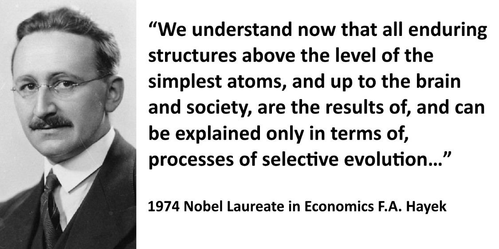

# An Introduction to Hayekian Cultural Evolution

The human body/organism and the numerous "systems" that coordinate it like the respiratory, nervous, and digestive "systems", is the result of the actions of some 30 trillion cells but obviously NOT the result of any conscious planning or designing by them. Thanks to the likes of Darwin and a modern understanding of genetics we can understand how natural selection was the inadvertent "designer" of such systems and complex order. The global socioeconomic order, or what the great British 19th century thinker Herbert Spencer referred to as ["The Social Organism"](https://oll.libertyfund.org/titles/spencer-the-man-versus-the-state-with-six-essays-on-government-society-and-freedom-lf-ed), is also coordinated by a "system", by what economists of the so-called 'Austrian School' like Ludwig von Mises and his great protégé, 1974 Nobel Laureate in Economics F.A. Hayek, referred to as "The Market Process". 'The Market Process' and the "parts" it is composed of like money, prices, economic competition, interest rates, and the legal/religious/governmental frameworks that sustain it, "are indeed the result of human action, but not the execution of any human design" ([Adam Ferguson](https://oll.libertyfund.org/titles/1428#Ferguson_1229_388)). The 'market process' shares this trait with language which is also a complex mechanism that is the result of human action but was not consciously designed or invented by people/cells. Just like cells are unaware of why they act the way they do and how natural selection has evolved them over billions of years to be parts of complex multi-cellular organisms, so is mankind unaware of how "processes of selective evolution" have shaped "the brain and society" and created "the market process" which coordinates our actions to create Spencer's "Social Organism". 

Standing on Mises' shoulders, who provided him with a superb explanation of the workings of the economy and thus all aspects of the market process(money/prices/interest rates/etc.) and much, much, much more, Hayek would go on to explain how culture and 'the market process' had co-evolved to transform homo sapiens, from tribes of slightly smarter apes, into today's massively complex global socioeconomic order/'Social Organism' thus arguably becoming the first person in the history of mankind to provide a complete evolutionary understanding of how the world works. Hayek is still is so far ahead of our time that even today's leading thinkers, like renowned popular science writer Matt Ridley, are just catching up to the enormity of his insights. Ridley humbly acknowledges this in a 2011 speech where he mentions:

>"As someone who came to Fredrick von Hayek comparatively late in life, I'm still catching up with him...Indeed, many of the insights I thought I had discovered in my own readings and writings on the frontier of evolutionary biology and economics it turns out Hayek had long before me...It's Hayek who first puts it all together." - [Matt Ridley](https://www.youtube.com/watch?v=pG-grkJPU8Q)

So how did Hayek 'put it all together'?. Hayek realized that "all enduring structures above the level of the simplest atoms, and up to the brain and society" require precise information to sustain/coordinate/expand their order. If one understands how information coordinates the biological and social orders, then one understands how the world works. Let's briefly try to get a feel for how Hayek saw the world. 

"Processes of selective evolution" can be said to have created two mechanisms for creating two types of orders/"enduring structures", biological and social. The biological order is created via the well-known mechanism of 'biological evolution' with genes being like the sentences which store the information necessary to create/coordinate life/order. Mutations cause new genes and thus new information to arise which leads to a different life-form which is then 'naturally selected' as it inadvertently competes with others, with the winner reproducing more and thus passing on more copies of the better-adapted/"fitter" genes/information/design to later generations.

In the 'Social Organism' new/superior information arises and spreads largely thanks to economic competition. Economic competition motivates the social order's billions of minds to constantly innovate and copy each other's innovations thus continuously generating and spreading superior information, inadvertently reordering society as fast as humanly possible/profitable, turning it into a sort of super-computer which coordinates the transformation of matter into socioeconomic order/life. For example, all private sector orders/companies like BMW, Ford, and Toyota are constantly innovating and copying each other's innovations like power door-locks/windows and more recently electric vehicles thus continuously creating/spreading superior information and subsequent order. Why do they do this? Because potential customers have the freedom to trade their life/order sustaining wealth with the better informed auto-manufacturers/competitors. This in turn motivates all competitors to learn/copy each other lest they not get enough revenue/wealth with which to pay their employees a competitive wage so they leave to join the better informed and thus more productive/efficient orders. This wonderful automatic mechanism is "turned on" or "emerges" from the simple concept, or better said, tradition of 'private property'. Private property gives everyone in our role as consumers the 'freedom to trade' our life/order-sustaining wealth for what we calculate/think is best. This 'freedom to trade/choose' in turn motivates everyone, in our role as producers, to discover how to order ourselves in a manner that produces something society/customers value (our labor, a product/service), which we do by, once again, innovating and/or copying/learning existing ideas/information, in other words, by competing in the economic sense. Most of us simply choose to produce and then trade our labor with a company/order that knows how to further incorporate our labor in a more competitive/profitable way.

Just like in the Olympics we can discover the best athletes in the world due to global competition, so does free-trade among all nations/peoples/orders allows the best ideas to compete/spread globally thus ensuring the best possible global order. As cost-cutting ideas emerge and inevitably spread via competition leading relative prices to continuously fall, new profitable ideas easily arise and once again spread via competition in an endless cycle of knowledge generation/innovation. For example, computers were once very expensive, but once the price of making them came down enough, people easily realized that every home could have them, which gave birth to our computerized world and the Internet and all the great things that flow from it. The more wealth is produced, the more wealth has to be offered in exchange for labor as companies/orders compete against each other for the labor they need which helps explain why the economic pie grows for everyone. For example, imagine that after a shipwreck you end up in an island where everyone has a machine that can turn dirt into food. Tom wants your labor to build a home, Mark, to build a boat, and Gina to plant a garden. Competition will motivate them to offer you all the food you want and more.  

It is important to envision the socioeconomic order as it really exists as if looked at from high above with people coming together/apart as companies/orders emerge and dissolve in ever-changing conditions. Superior information arising and rippling/restructuring the social order thanks to competition. As orders get more productive they lure other people to 'trade-with'/'join-them' by offering more money/wealth for their labor relative to other companies/orders, eventually causing the least productive orders to sort of dissolve as their 'factors of production' like labor, buildings, etc. are bid away to be parts of more productive plans/orders. A sort of swarm intelligence emerges as the all-pervasive public quickly nourishes the growth and spread or superior orders/companies/information, inadvertently expanding the worldwide "division of labor and information" as entire neighborhoods/cities morph themselves in specialized ways as complementary pieces of information/orders segregate themselves in distinct geographical locations like the software industry in Silicon Valley, California and manufacturing in Guangdong, southern China. As Mises reminds us "The division of labour is a fundamental principle of all forms of life." The division of labor is a pattern/way which natural selection rediscovers to enable smaller units/orders to efficiently compartmentalize labor/information as they contribute-to (and are nourished-by) a larger organism they become parts of(Organelles -> Cells -> Organs -> Humans -> Social Organism).

Having discussed one vital aspect of the market process (competition) as well as how 'private property' inadvertently leads to its emergence, we can now discuss how 'processes of selective evolution' evolved the 'market process'/'Social Organism' without conscious human planning or design similarly to how they evolved the necessary mechanisms to turn cells into members of multicellular organisms. As Carl Menger asks:

>"How can it be that institutions that serve the common welfare and are extremely significant for its development come into being without a common will directed towards establishing [them?"](https://cdn.mises.org/Investigations%20into%20the%20Method%20of%20the%20Social%20Sciences_5.pdf) 

Hayek answered this monumentally important question more or less as follows. If we envision mankind about 50,000 years ago, we would see a sort of petri-dish of competing cultures(languages/concepts/rules/laws) that are being 'naturally selected' based on their ability to grow the groups that contain them relative to other groups. Customs/concepts/rules/religions/etc. that inadvertently cause their respective social orders to grow whether it'd be via conquest, successful defense, migration into, imitation, etc., expand their order AND the very customs/concepts/rules/ideologies/etc. which helped them thrive. Every rule/law has an effect in the productivity/growth/survival of a social order. Given that a society/tribe is likely to have hundreds of such rules/concepts it is impossible to know the exact impact of any one of them when considering the overall competitiveness of a society/order. For simplicity's sake let us focus on just one rule, what is the optimal punishment for theft? Let's assume that in culture/tribe 'A' when a man steals he is killed which might deter many thefts but decreases the number of people in the group and all the productivity that this person might contribute in the future. In tribe 'B' they cut off a hand, and in tribe 'C' 10 lashes. Let's assume that tribe A's custom/rule of killing the thief actually proved to lead to a "fitter" social order. Perhaps it turns out that cutting off the hand led to an unproductive person that became a big drain on rest of tribe and a weak/useless fighter when it came to offense/defense so it was better if he was dead, and that lashes proved to not be enough of a deterrent which led to many thefts and retaliatory violence which turned out to be more costly than losing a member of the tribe. For simplicity's sake let us assume that this was by far the most important custom/rule affecting the growth/fitness of the social order, and that because of this, tribe/culture 'A' eventually displaced the others so that its kill-thieves rule/custom survived while the other punishments disappeared. The kill-thieves rule, is the result of human action, yet not the result of conscious human planning or design with the reasoned or conscious goal of having a more competitive/fit social order. The real designing of this rule or cultural element was made, not by innate instinct or human reason, but by 'natural selection'/competition/'group selection'/'cultural evolution'.

This concept of 'cultural evolution'/'group selection' allowed Hayek to identify a sort of 'third dimension'/source/mechanism for discovering/spreading knowledge which was neither instinctual (tied to our genetics/biology), nor the result of our conscious reason. As Hayek liked to refer to it, it was a mechanism for creating/spreading information which laid "between instinct and reason" and is the largely unknown/understood source of knowledge that played the vital role in the evolution of culture, the market process and related social institutions. Omnipresence, the ability to be everywhere at all times is another concept that would provide a great benefit to religions that used it to describe their God. Without God's omnipresence you could get away with breaking the rules that give society order and only have to face the consequences brought upon by fellow men. But if God is everywhere, watching your every move, you will be much more likely to follow those rules that give your society a productive social order. A similar case can be made for the concepts of "sin" and "evil". Did clever men "conspire" to create our religions to control us? Of course not, like the 'market process' they too "are indeed the result of human action, but not the execution of any human design". These concepts/rules help enforce constraints on what for brevity's sake we'll refer to as our evolved tribalistic('small group')/primate-like nature/instincts, which for millions of years were shaped by things like cannibalism, rape, tribal warfare and other practices which are now seen as abhorrent and whose relatively recent suppression via culture/religion/law enabled the emergence of the 'Social Organism'/civilization. Growing up is about programming/molding our flexible brains into learning all of these rules and thus rewiring them to be as happy as possible even though many of these restrictions go counter to our 'uncivilized instincts'. We have tentacle porn, Q.E.D. Obviously the molding/brainwashing fails quite often when we engage in rape/torture/militarism/war/"sin" and more. One can easily speculate about how the simplicity and pro-private-property character of Judaism's Ten Commandments ('Thou shalt not steal/murder/'commit adultery'/ 'covet(neighbor's…)) and monotheism helped it be more 'viral' and thus be 'naturally selected' over other beliefs/religions that might have been more complex/confusing/contradictory and also be less respectful of private property thus inadvertently foregoing the emergence of the market process and corresponding 'Social Organism'/Civilization. Just like natural selection modified solitary cells to have tumor suppressing genes to control rapid cell division/proliferation (cancer) in order to cooperate in a multi-cellular organism, so has cultural evolution likewise molded us to suppress these "uncivilized" tendencies. As Hayek tells us:

>"Man has been civilized very much against his wishes. It was the price he had to pay for being able to raise a larger number of children. We especially dislike the economic disciplines… The indispensable rules of the free society require from us much that is unpleasant, such as suffering competition from others, seeing others being richer than ourselves, etc., etc." (Hayek "Law, Legislation and Liberty, Volume 3: The Political Order of a Free People" 1981, p. 168)

>"Constraints on the practices of the small group, it must be emphasized and repeated, are hated. For as we shall see, the individual following them, even though he depend on them for life, does not and usually cannot understand how they function or how they benefit him."…"Disliking these constraints so much, we hardly can be said to have selected them; rather, these constraints selected us: they enabled us to survive." (Hayek "The Fatal Conceit", 1989, p. 14)

When/how did we begin "naming" people which would bring a tremendous advantage for group cooperation. Associating ideas/language with the concept of the "self"? And linking the "self" with group/religious/tribal identities which was vital for group/tribal cohesion in war/conquest/defense? These vital early cultural concepts are neither "in our genes", and also "do not prove to be the result of an intention aimed at this purpose, i.e., the result of an agreement of members of society" [(Menger)](https://books.google.com/books?id=3NdnezJePIQC&pg=PA130&lpg=PA130&dq=result+of+an+intention+aimed+at+this+purpose,+i.e.,+the+result+of+an+agreement+of+members+of+society&source=bl&ots=UC_E8u_fPu&sig=ACfU3U13Jzkf_em3RgupNaY7li841zhG9w&hl=en&sa=X&ved=2ahUKEwjnzteF5_7mAhXiNX0KHXFKBVwQ6AEwAHoECAUQAQ#v=onepage&q=result%20of%20an%20intention%20aimed%20at%20this%20purpose%2C%20i.e.%2C%20the%20result%20of%20an%20agreement%20of%20members%20of%20society&f=false), they were designed/refined by competition between groups. 

What about human "reason"? It too has far more to do with cultural evolution than most realize. Imagine the following cruel scenario. A baby is taken from his mother at birth and raised by plain-looking mechanical arms. No human being looks at him in the eyes implying that there is a "self" behind them. He never sees his own reflection, is never spoken to and thus never picks up a language which is crucial for thinking. For example, Mises writes:

>"Thought is bound up with speech. The thinker's conceptual edifice is built on the elements of language. The human mind works only in language; it is by the Word that it first breaks through from the obscurity of uncertainty and the vagueness of instinct to such clarity as it can ever hope to attain. Thinking and that which is thought cannot be detached from the language to which they owe their origin." [(Mises, "Socialism")](https://www.econlib.org/book-chapters/chapter-part-iiich-19/)

How would this unfortunate person "think" as an adult regardless of how powerful the brain and what it gets purely from genetics? Hayek writes:

>"It may well be asked whether an individual who did not have the opportunity to tap such cultural tradition could be said even to have a mind" (Hayek, "The Fatal Conceit")

My guess is that a bonobo/ape, raised among humans and taught some rudimentary sign language would act far, far more reasonably than this "culture/software-less" person. And again, what is the process that designs those things like language, religions, 'the market process' which "are indeed the result of human action, but not the execution of any human design"(Ferguson)? Natural Selection/competition via Hayek's 'group selection'.

Knowing that 'private property' is the simple concept/institution that leads to a chain-reaction of incentives which creates the Social Organism, we can easily see that those tribes/orders whose customs/religions inadvertently became more peaceful and thus less violent, extended peace/friendship/trade to those outside the tribe, etc., in other words, those who tended to respect 'private property' and thus individual freedom more and more, would become more advanced/powerful, and as they grew, they would inadvertently spread the very customs (increasing respect for private property, tolerance, and commercial culture that emerges from it) and evolving economic system (market process/capitalism) that allowed them to reach such relative heights. Once again, the true sort of 'designer' of the market process was our old friend 'natural selection'/competition acting on groups/cultures, inadvertently selecting those customs/ideologies/concepts as if they were genes. We are now in a position to understand Hayek when he writes:

>"The ultimate decision about what is accepted as right and wrong will be made not by individual human wisdom but by the disappearance of the groups that have adhered to the "wrong" beliefs."

>"Culture is neither natural nor artificial, neither genetically transmitted nor rationally designed. It is a tradition of learnt rules of conduct which have never been 'invented' and whose functions the acting individuals usually do not understand" (Hayek "Law, Legislation and Liberty, Volume 3: The Political Order of a Free People" 1981, p. 155)

>"To understand our civilisation, one must appreciate that the extended order resulted not from human design or intention but spontaneously: it arose from unintentionally conforming to certain traditional and largely moral practices, many of which men tend to dislike, whose significance they usually fail to understand, whose validity they cannot prove, and which have nonetheless fairly rapidly spread by means of an evolutionary selection - the comparative increase of population and wealth - of those groups that happened to follow them. The unwitting, reluctant, even painful adoption of these practices kept these groups together, increased their access to valuable information of all sorts, and enabled them to be 'fruitful, and multiply, and replenish the earth, and subdue it' (Genesis 1:28). This process is perhaps the least appreciated facet of human evolution." (Hayek, "The Fatal Conceit" p. 6)

We must stress the fact that the cultural evolutionary process which has created 'the market process' and resulting 'Social Organism'/civilization is much, much faster than the slow genetic biological evolution thus rendering slight genetic differences between races/populations largely irrelevant. As Hayek tells us:

>"With respect to what we mean by cultural evolution in a narrower sense, that is, the fast and accelerating development of civilization…Since it differs from genetic evolution by relying on the transmission of acquired properties, it is very fast, and once it dominates, it swamps genetic evolution" [(Hayek "Law, Legislation and Liberty, Volume 3: The Political Order of a Free People" 1981, p. 156)](https://books.google.com/books?id=9IpEBAAAQBAJ&pg=PA489&lpg=PA489&dq=%22With+respect+to+what+we+mean+by+cultural+evolution+in+a+narrower+sense,+that+is,+the+fast+and+accelerating%22&source=bl&ots=unmroxTPbu&sig=ACfU3U1hRwunoRJDJ9cd_DAAu0YcZ-uEoA&hl=en&sa=X&ved=2ahUKEwjZkY6Hw_jmAhWBMX0KHbatDF4Q6AEwAHoECAYQAQ#v=onepage&q=%22With%20respect%20to%20what%20we%20mean%20by%20cultural%20evolution%20in%20a%20narrower%20sense%2C%20that%20is%2C%20the%20fast%20and%20accelerating%22&f=false)

Also:

>"…biological evolution would have been far too slow to alter or replace man's innate responses in the course of the ten or twenty thousand years during which civilisation has developed…. Thus it hardly seems possible that civilisation and culture are genetically determined and transmitted. They have to be learnt by all alike through tradition." (Hayek's 'The Fatal Conceit' page 16)

As numerous great free-market thinkers like Mises, [Robert Higgs](https://mises.org/library/rise-west), and [Ralph Raico](https://mises.org/library/european-miracle-0) just to name a few have shown, during the last couple thousand years different groups of people in widely dispersed locations like, the Middle East, Asia, and Europe, traded the sort of title for most socioeconomically advanced places in the planet. For example, with respect to the momentary lead in terms of civilization that China had, Hayek writes:

>"…the history of China provides many instances of government attempts to enforce so perfect an order that innovation became impossible. This country, technologically and scientifically developed so far ahead of Europe that, to give only one illustration, it had ten oil wells operating on one stretch of the river Po already in the twelfth century, certainly owed its later stagnation, but not its early progress, to the manipulatory power of its governments. What led the greatly advanced civilisation of China to fall behind Europe was its government's clamping down so tightly as to leave no room for new developments, while, as remarked in the last chapter, Europe probably owes its extraordinary expansion in the Middle Ages to its political anarchy" (Hayek's 'The Fatal Conceit' page 44)

Given mankind's lack of familiarity with the aforementioned concepts, it is quite understandable how various race-related fallacies which equate civilization with white people/race, like British/European Imperialism and Nazism, dominated much of the last few centuries and are still very influential under the covers. To one economically ignorant horde of slightly smarter apes (the political "Left"/"Democrats"), the political "Right"/"Republicans" is just the "racist white-man who uses capitalism to exploit and maintain the status quo for his benefit". The fact that many whites understandably make the erroneous assumption that their blood/race was a very significant factor in the recent emergence of civilization only helps add fuel to the Left/Right polarization. Many whites, with the best of intentions might be ashamed of the imperialist past of their ancestors or of the racism of their parents/uncles/etc. and erroneously believe that such a past/racism is a significant factor in the relative underachievement/problems of other groups/minorities. Both groups are wrong. Although it is certainly true that there must be differences in mental ability just like there are differences in physical ones, these minute differences are largely irrelevant. The explosion in relative human prosperity and technology mankind has stumbled upon during the last 200 years has little to do with biological differences and much more to do with the expansion of the global division of labor/information/free-trade/competition/Capitalism, etc. If a human being can grow up and learn something as complex as a language, which can take even the brightest of people years to master, everyone has more than enough intelligence to understand the basics of how freedom and privatization are the keys to rapid socioeconomic progress. Clever economic education/marketing is obviously the key. Mises:

>"Liberalism is rationalistic. It maintains that it is possible to convince the immense majority that peaceful cooperation within the framework of society better serves their rightly understood interests than mutual battling and social disintegration. It has full confidence in man’s reason. It may be that this optimism is unfounded and that the liberals have erred. But then there is no hope left for mankind’s future."
